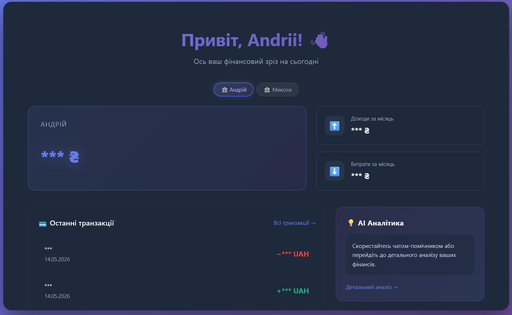
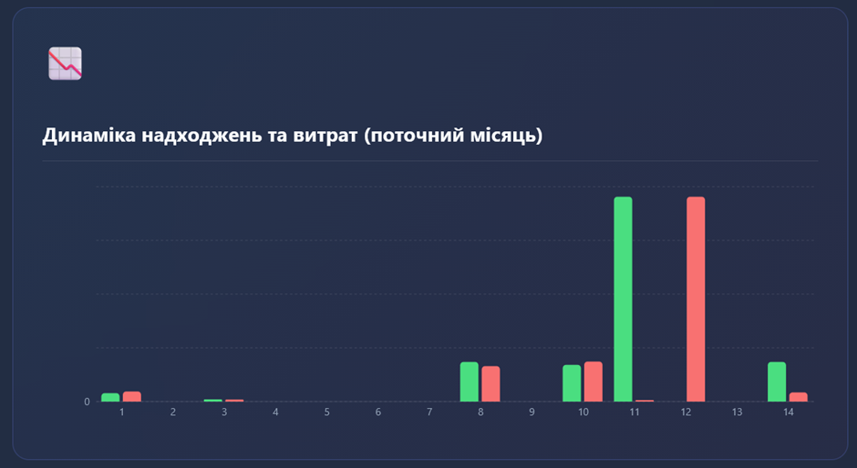
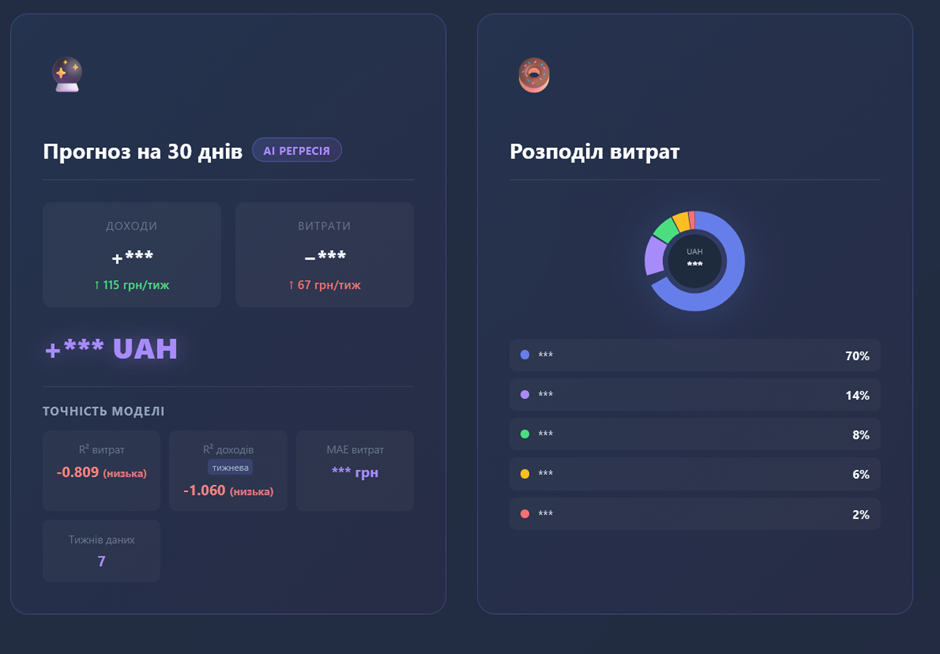
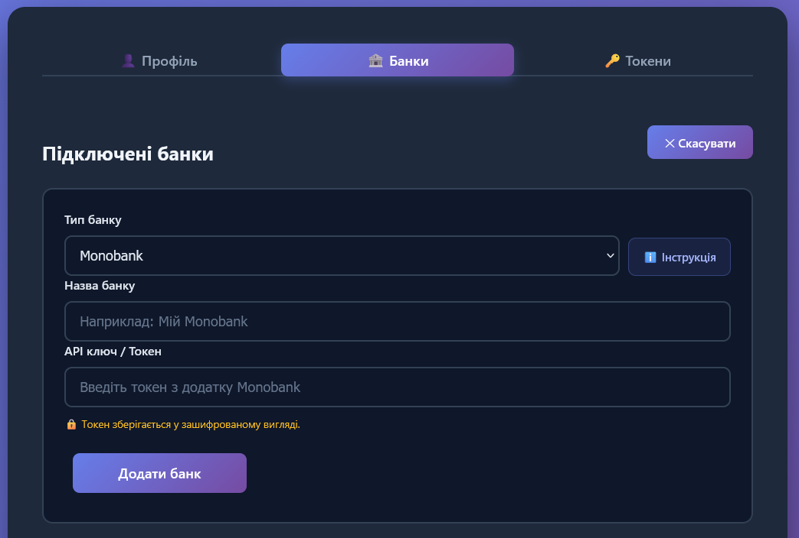

# 📘 Система управління особистими фінансами (BanFin)

> *Веб-застосунок для агрегації фінансових даних з різних банків та криптовалютних бірж, їх аналітики та управління.*

---

## 👤 Автор

- **ПІБ**: Вовк Андрій
- **Група**: ФЕІ-44
- **Керівник**: Гура Володимир, кандидат технічних наук, асистент
- **Тема дипломної роботи**: Розроблення веб додатку для фінансового планування
- **Дата виконання**: [дд.мм.рррр]

---

## 📌 Загальна інформація

- **Тип проєкту**: Вебсайт
- **Мова програмування**: Python (Backend), JavaScript (Frontend)
- **Фреймворки / Бібліотеки**: Django, Django Rest Framework, Celery, React, Vite, Axios, Recharts
- **База даних**: MongoDB, Redis

---

## 🧠 Опис функціоналу

- 🔐 Реєстрація, авторизація та управління профілем користувача (JWT).
- 🏦 Мульти-акаунтинг: підключення та синхронізація рахунків Monobank.
- 🪙 Інтеграція з криптовалютними біржами: відстеження балансів на Binance, Bybit та OKX.
- 📊 Аналітика: візуалізація доходів, витрат та розподілу активів за допомогою інтерактивних графіків.
- 🔄 Фонова синхронізація транзакцій та актуальних курсів валют.
- 🔒 Безпечне зберігання інтеграційних ключів з використанням AES шифрування.

---

## 🧱 Опис основних класів / файлів

| Клас / Файл     | Призначення |
|----------------|-------------|
| `backend/manage.py` | Точка входу backend (Django) |
| `frontend/src/main.jsx` | Точка входу frontend (React) |
| `backend/finance/models.py` | Моделі бази даних (UserProfile, BankConnection, CryptoExchange тощо) |
| `backend/finance/services/` | Сервіси інтеграції з API банків та криптобірж |
| `frontend/src/templates/` | Основні сторінки застосунку (Dashboard, Analytics, Profile, Login) |

---

## ▶️ Як запустити проєкт "з нуля"

### 1. Встановлення інструментів

- Python 3.8+
- Node.js v16+ 
- MongoDB (локально або Atlas)
- Redis (для фонових задач Celery)

### 2. Клонування репозиторію

```bash
git clone <repository-url>
cd Diploma-work
```

### 3. Налаштування Backend

```bash
cd backend
# Створення та активація віртуального середовища
python -m venv venv
.\venv\Scripts\activate  # Windows
# source venv/bin/activate # Linux/macOS

# Встановлення залежностей
pip install -r requirements.txt
```

#### Створення `.env` файлу для backend:
Створіть файл `.env` у папці `/backend`:
```env
SECRET_KEY=your_secret_key_here
DEBUG=True
MONGODB_URI=mongodb://localhost:27017/
MONGODB_DATABASE=diploma_db
```

#### Міграції:
```bash
python manage.py migrate
```

### 4. Налаштування Frontend

```bash
cd ../frontend
npm install
```

### 5. Запуск

Можна скористатися готовим скриптом з кореневої папки:
```powershell
# Windows
.\start.ps1
```
```bash
# Linux/Mac
chmod +x start.sh
./start.sh
```

Або запустити вручну:
- **Backend**: `python manage.py runserver`
- **Celery**: `celery -A config worker -l info`
- **Frontend**: `npm run dev`

---

## 🔌 API приклади

### 🔐 Авторизація

**POST /api/auth/token/**

```json
{
  "username": "user",
  "password": "123456password"
}
```

**Response:**

```json
{
  "refresh": "jwt_refresh_token",
  "access": "jwt_access_token"
}
```

---

### 🏦 Банківські підключення

**GET /api/finance/bank-connections/**

Отримати список підключених банківських рахунків.

**POST /api/finance/bank-connections/**

```json
{
  "bank_name": "monobank",
  "api_key": "your_secure_api_token"
}
```

---

## 🖱️ Інструкція для користувача

1. **Головна сторінка / Реєстрація**:
   - `Зареєструватись` створює новий акаунт.
   - `Увійти` дозволяє зайти у існуючий профіль.
2. **Після входу**:
   - Перейдіть у **Профіль (Налаштування)** щоб підключити ваш банк або криптовалютну біржу, ввівши відповідні API-ключі.
   - Відкрийте **Дашборд (Головна)**, щоб переглянути загальний баланс та останні операції.
   - Розділ **Аналітика** відобразить графіки розподілу витрат за обраний місяць.
3. **Інші функції**:
   - Ви можете переглядати детальну історію у розділі **Транзакції**.
   - `Вийти` — для безпечного завершення сесії.

---

## 📷 Приклади / скриншоти

### Головна сторінка (Дашборд)


### Графіки (Аналітика)

<br><br>


### Форма підключення банку (Профіль)


---

## 🧪 Проблеми і рішення

| Проблема              | Рішення                            |
|----------------------|------------------------------------|
| 500 Internal Server Error | Перевірити підключення до MongoDB та правильність URI у .env |
| Транзакції не оновлюються | Перевірити, чи запущений сервер Redis і чи працює Celery worker |
| CORS помилка         | Перевірити CORS_ALLOWED_ORIGINS у `backend/config/settings.py` |

---

## 🧾 Використані джерела / література

- Офіційна документація Django та Django Rest Framework
- Документація React та Vite
- MongoDB (djongo) документація
- Celery Task Queue Documentation
- JWT.io
